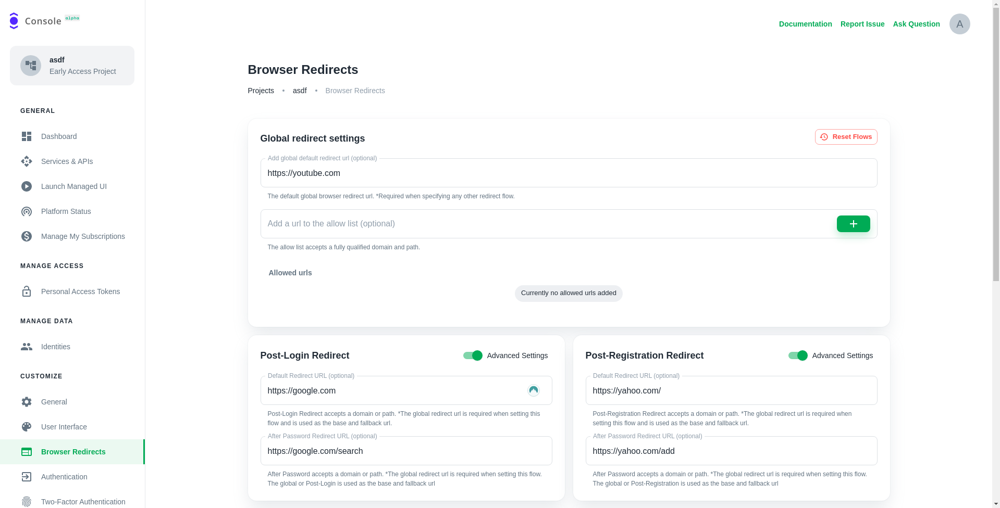

# Example Integration for Ory with NextJS (ReactJS + TypeScript)

This is an example using ReactJS to build an app with

- [a page which shows if the user is logged in or not](pages/index.tsx)
- [a page](pages/protected.tsx) using an [API endpoint](pages/api/protected.ts)
  which is protected
- [login](pages/login.tsx)
- [registration](pages/ui/registration.tsx)
- [account settings](pages/ui/settings.tsx)
- [account verification](pages/ui/verification.tsx) (e.g. email, phone, activate
  account)
- [account verification](pages/ui/recovery.tsx) (e.g. reset password)

To avoid the complexity of setting up routing and state management - in the
hopes of making this example easy to consume

- we have chosen NextJS as the framework.

All pages work with Ory Cloud's SDKs and APIs as well as with open source Ory
Kratos!

## Run ReactJS + TypeScript + NextJS + Ory

Before we head deep into the details, let's see the demo live! First, clone this
repository and then choose whether you want to use Ory Cloud or Open Source Ory
Kratos!

### Ory Cloud

Get started by
[signing up for an Ory Cloud account](https://console.ory.sh/registration) and
creating your first
[Ory Cloud Project](https://www.ory.sh/docs/start-building/create-project). Then
create a
[personal access token](https://www.ory.sh/docs/guides/create-personal-access-token)
get the Project's
[SDK Configuration](https://www.ory.sh/docs/concepts/services-api/#sdk-configuration)
and set it in your environment and start the process:

```
npm i
export ORY_ACCESS_TOKEN=...
```

To get everything to work smoothly, we recommend setting the appropriate UI
endpoints in your Ory Cloud Project under the "User Interface" menu item:

- Login UI: `https://localhost:4000/login`
- Registration UI: `https://localhost:4000/registration`
- Settings UI: `https://localhost:4000/settings`
- Verification UI: `https://localhost:4000/verification`
- Recovery UI: `https://localhost:4000/recovery`
- Error UI: `https://localhost:4000/error`


Also, ensure to set up your redirects correctly so you end up at the right
endpoint after you have signed up or signed in!



Once that is done, start the NPM process:

```
npm run dev
```

This command will set up the Ory Proxy and NextJS (see details in the following
sections). Due to this, you will be prompted for a password in order to set up
HTTPS on your machine. Depending on the order of execution, it is possible that
the prompt is a bit hidden like here:

```
To modify your operating system certificate store, you might might be prompted for your password now:
Password:event - compiled successfully
```

In that case, type your password and press enter and everything will come live!
Next head over to [https://localhost:4000/](https://localhost:4000/) to see the
app in action!

### Open Source Ory Kratos

## THIS DOES NOT WORK YET

If you are using Open Source Ory Kratos
([read the quickstart](https://www.ory.sh/kratos/docs/quickstart)), set the
`ORY_KRATOS_PUBLIC_URL` to Ory Kratos' Public URL:

```
npm i
export ORY_KRATOS_PUBLIC_URL=http://...

# In the case of the Quickstart this would be:
# export ORY_KRATOS_PUBLIC_URL=http://localhost:4455

npm run dev:next
```

## Start From Scratch

To start from scratch, initialize the NextJS App

```
npx create-next-app --ts
```

and install `npm-run-all` which allows us to run both the Ory Proxy as well as
NextJS alongside each other.

```
npm i --save-dev npm-run-all
```

### Installing Ory Components

Install the [Ory Proxy](https://www.ory.sh/docs/guides/proxy) which is shipped
with the Ory CLI:

```
npm i --save @ory/cli
```

To make things easy, also install the Ory Cloud SDK. If you are using the Open
Source, then install the Ory Kratos SDK:

```
# Cloud:
npm i --save @ory/client

# Open source:
npm i --save @ory/kratos-client
```

### Running Proxy and NextJS in Parallel

And finally set up our `package.json` so that it runs the Ory Proxy as well as
NextJS using `npm-run-all` with the `--parallel` flag:

```diff
  "scripts": {
-   "dev": "next dev",
+   "dev": "npm-run-all --parallel dev:next dev:proxy",
+   "dev:next": "next dev",
+   "dev:proxy": "ory proxy local --port 4000 http://localhost:3000",
    "build": "next build",
    "start": "next start",
    "lint": "next lint",
  },
```

## Deploy on Vercel

**THIS DOES NOT WORK YET**

Please not that this section only works with Ory Cloud, as the Ory Proxy is
required. If you run open source Ory Kratos, setting up this example app on
Vercel heavily depends on your deployment environment!

The easiest way to deploy your Next.js + Ory Cloud app is to use the
[Vercel Platform](https://vercel.com/new?utm_medium=default-template&filter=next.js&utm_source=create-next-app&utm_campaign=create-next-app-readme)
from the creators of Next.js.

If you have never deployed on Vercel, check out the
[Next.js deployment documentation](https://nextjs.org/docs/deployment) for more
details.

Deploying the app is easy. Ensure that your build works by running

```
npm run build
```

Then, set up your [Vercel](https://vercel.com/) account and create a new app.
You will need to configure your Ory Cloud Personal Access Token as an
environment variable for your app:

BAD IDEA - will be bundled!

Next all you need to do is to run the deploy command:

```
npx vercel deploy --prod
```

### Deploying to Production with Ory Proxy and Vercel

Behind the scenes we are using the same trick as we are doing for local
environments for production as well:

```diff
  "scripts": {
    // ...
-   "start": "next start",
+   "start": "npm-run-all -p start:next start:proxy",
+   "start:next": "PORT=4000 next start",
+   "start:proxy": "ory proxy production --port $PORT http://localhost:4000 https://$VERCEL_URL",
    // ...
  },
```
